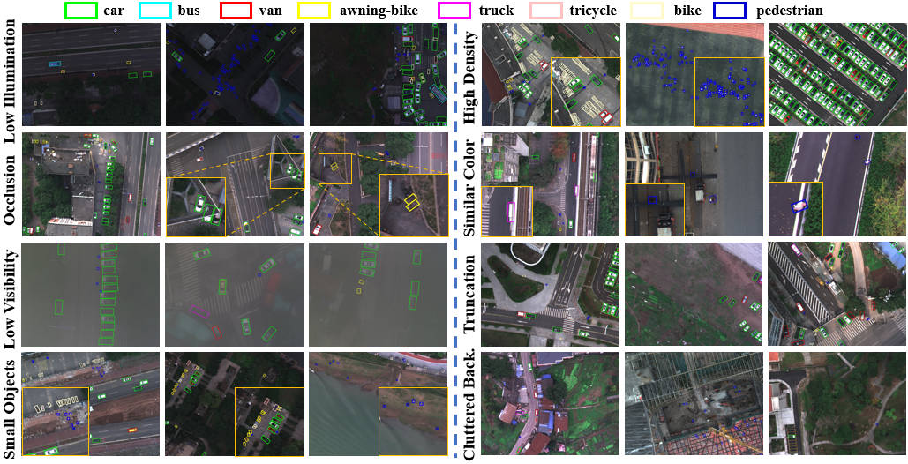

MODA: The First Challenging Benchmark for Multispectral Object Detection in Aerial Images

**Han Shuaihao**, **Xu Tingfa***, **Liu Peifu**, **Li Jianan***  
*Beijing Institute of Technology*  
Presented at **AAAI 2026**  
[[**arXiv**](https://arxiv.org/abs/2512.09489)]

---

## Abstract


Aerial object detection faces significant challenges in real-world scenarios, such as small objects and extensive background interference, which limit the performance of RGB-based detectors with insufficient discriminative information. Multispectral images (MSIs) capture additional spectral cues across multiple bands, offering a promising alternative. However, the lack of training data has been the primary bottleneck to exploiting the potential of MSIs. To address this gap, we introduce the first large-scale dataset for Multispectral Object Detection in Aerial images (MODA), which comprises 14,041 MSIs and 330,191 annotations across diverse, challenging scenarios, providing a comprehensive data foundation for this field. Furthermore, to overcome challenges inherent to aerial object detection using MSIs, we propose OSSDet, a framework that integrates spectral and spatial information with object-aware cues. OSSDet employs a cascaded spectral-spatial modulation structure to optimize target perception, aggregates spectrally related features by exploiting spectral similarities to reinforce intra-object correlations, and suppresses irrelevant background via object-aware masking. Moreover, cross-spectral attention further refines object-related representations under explicit object-aware guidance. Extensive experiments demonstrate that OSSDet outperforms existing methods with comparable parameters and efficiency.

---

## Dataset Highlights

**MODA** is the *first* large-scale benchmark for **Multispectral Aerial Object Detection (MAOD)**.  

- ** Large Scale** — 14K MSIs, 330K annotated oriented boxes across 8 categories  
- ** Multispectral Imagery** — 8-band MSI covering visible to near-infrared spectrum  
- ** Oriented Bounding Boxes (OBB)** — precise orientation labels for robust aerial association  
- ** Real UAV Scenarios** — varying altitudes, illumination, and scenes
---

## Example Visualization

<p align="center">
  
</p>

*Example annotations from MODA illustrating a variety of challenging scenarios. In these cases, spatial information is often limited due to small object size, background clutter, or motion blur, making spectral cues essential for accurate and reliable object discrimination. Zoom in to examine details more clearly.*

---

## 

## Benchmarking Results of MSI Input

| Method Category | Method | car | bus | van | aw-bike | truck | tricycle | bike | pedestrian | mAP_50 | mAP_75 | mAP | FLOPs | Params |
|-----------------|--------|-----|-----|-----|---------|-------|----------|------|------------|--------|--------|-----|-------|--------|
| **Two-stage**   | Gliding Vertex | 90.3 | 89.1 | 73.8 | 69.5 | 66.0 | 46.7 | 41.4 | 22.6 | 62.4 | 35.7 | 34.7 | 230.8G | 41.4M |
|                 | Roi Transformer | **90.5** | 89.3 | 75.2 | 73.3 | 68.7 | 51.8 | 44.5 | 30.0 | 65.4 | 43.4 | 40.7 | 244.7G | 55.3M |
|                 | StripRCNN  | **90.5** | 89.0 | 76.1 | **73.6** | 67.1 | 56.5 | 45.2 | 30.7 | 66.1 | 44.0 | 41.0 | 231.8G | 45.2M |
| **One-stage**   | GWD  | 90.4 | 79.9 | 70.7 | 59.7 | 49.3 | 30.8 | 26.7 | 29.7 | 54.7 | 37.8 | 34.6 | 233.5G | 36.5M |
|                 | R3Det | 90.4 | 88.7 | 74.0 | 63.8 | 57.8 | 45.1 | 29.4 | 32.2 | 60.2 | 36.7 | 34.8 | 362.2G | 42.0M |
|                 | S²ANet| 90.4 | 88.7 | 74.4 | 69.1 | 62.7 | 48.9 | 30.1 | 40.7 | 63.1 | 38.7 | 36.7 | 216.5G | 38.8M |
|                 | R3Det-KLD | 90.4 | 88.7 | 74.8 | 66.6 | 60.9 | 42.6 | 29.8 | 35.5 | 61.1 | 39.4 | 36.8 | 306.7G | 39.6M |
|                 | LSKNet | **90.5** | 89.5 | 76.1 | 72.5 | 68.6 | 51.8 | 38.9 | 43.1 | 66.4 | 41.3 | 38.6 | **194.9G** | **29.9M** |
|                 | S2ADet† | 90.3 | 86.6 | 72.1 | 71.3 | 57.2 | 54.1 | 35.0 | 40.8 | 63.5 | 41.1 | 38.9 | 406.0G | 65.2M |
|                 | Rot. FCOS | 90.3 | 86.3 | 75.2 | 71.2 | 59.0 | 53.8 | 34.7 | 37.4 | 63.5 | 41.8 | 39.1 | 226.8G | 32.2M |
|                 | CFA | 90.4 | 89.0 | 76.7 | 69.7 | 64.4 | 55.1 | 43.1 | 41.5 | 66.2 | 43.2 | 40.6 | 213.6G | 36.9M |
|                 | Ori. RepPoints  | **90.5** | 89.2 | 77.7 | 71.2 | 66.2 | 53.1 | 43.0 | 41.1 | 66.5 | 44.1 | 40.9 | 213.6G | 36.9M |
|                 | **OSSDet (Ours)** | **90.5** | **89.9** | **79.2** | 72.7 | **69.7** | **58.8** | **45.3** | **45.7** | **69.0** | **45.9** | **42.7** | 278.1G | 36.5M |

† Methods originally designed for multispectral object detection.


---
## 📂 Dataset Download and Preparation

The **MODA dataset** can be obtained from the following source:
- 📦 [[**Baidu Netdisk**](https://pan.baidu.com/s/1iPhQG8BVTmF7cTqITNLzTw?pwd=moda)]

📁 **Standard Directory Layout**

  After downloading the data, your project's data should be organized as follows:
  ```text
  MODA
  ├── data
  │   ├── mod
  │   │   ├── train
  │   │   │   ├── images
  |   │   │   │   ├── train_00001.npy
  |   │   │   │   ├── ...
  │   │   │   └── labels
  |   │   │   │   ├── train_00001.txt
  |   │   │   │   ├── ...
  │   │   ├── test
  │   │   │   ├── images
  |   │   │   │   ├── test_00001.npy
  |   │   │   │   ├── ...
  │   │   │   └── labels
  |   │   │   │   ├── test_00001.txt
  |   │   │   │   ├── ...

  ```

## ⚙️ Environment and Project Setup

Refer to [MMRotate](https://github.com/open-mmlab/mmrotate), you can configure the environment required for this project by setting up the pipeline.

```bash
conda create -n moda python=3.8
conda activate moda

# PyTorch and dependencies
pip install torch==1.10.1+cu111 torchvision==0.11.2+cu111 torchaudio==0.10.1 -f https://download.pytorch.org/whl/cu111/torch_stable.html

pip install -U openmim
mim install mmcv-full==1.7.2
mim install mmdet==2.28.2
git clone https://github.com/open-mmlab/mmrotate.git
cd MODA
pip install -r requirements/build.txt
pip install -v -e .

# To support multispectral image input, replace the corresponding files in the virtual environment with the ones from the `pkg` folder, i.e.:

`pkg/custom.py` → `anaconda3/envs/moda/lib/python3.8/site-packages/mmdet/datasets/custom.py`
`pkg/loading.py` → `anaconda3/envs/moda/lib/python3.8/site-packages/mmdet/datasets/pipelines/loading.py`

```

---


## Training and Test

Different detectors can be trained using their respective configuration files. You can start training through:

```bash

CUDA_VISIBLE_DEVICES=0,1 tools/dist_train.sh config_file --work-dir your_word_dir

```

For example, youcan start training of OSSDet through:

```bash

CUDA_VISIBLE_DEVICES=0,1 tools/dist_train.sh configs/ossdet/start_level_0.py --work-dir work_dirs/ossdet/exp

```

Once you obtain the trained weights after training, you can test the accuracy through:

```bash

python tools/test.py config_file trained_weight --eval mAP

```

For example, you can start the test of OSSTet through:

```bash

python tools/test.py configs/ossdet/start_level_0.py work_dirs/ossdet/exp/latest.pth --eval mAP

```

---

## 💾 Pretrained Weights

Pretrained weights of OSSDet can be obtained from Google Drive:

👉 [Google Drive – Pretrained Models](https://drive.google.com/drive/folders/1oH1QYELz0IAKtDddHWBKoLxja1jUP5py?dmr=1&ec=wgc-drive-%5Bmodule%5D-goto)


## ⚖️ License

- **Code License**  
  Each submodule retains the **original license** of its respective repository.  
  Please refer to the `LICENSE` file within each subfolder for detailed terms.

- **Dataset License**  
  The **MMOT dataset** is released under the  [](https://creativecommons.org/licenses/by-nc-nd/4.0/). It is intended for academic research only. You must attribute the original source, and you are not allowed to modify or redistribute the dataset without permission.


## 🙏Acknowledgements

* This project is modified from **[MMRotate](https://github.com/open-mmlab/mmrotate)**. We sincerely thank the contributors and authors of MMRotate for providing the foundational framework for our implementation.

## 📖 Citation

If you use the MODA dataset, code, or benchmark results in your research, please cite:

```bibtex
@article{han2025moda,
  title={MODA: The First Challenging Benchmark for Multispectral Object Detection in Aerial Images},
  author={Han, Shuaihao and Xu, Tingfa and Liu, Peifu and Li, Jianan},
  journal={arXiv preprint arXiv:2512.09489},
  year={2025}
} 
